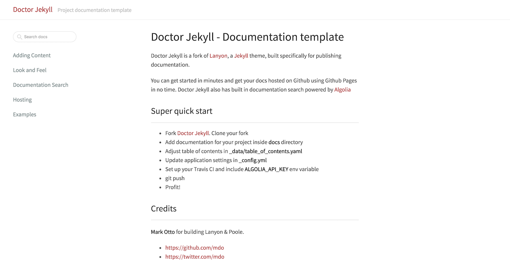

# Doctor Jekyll

Doctor Jekyll is a fork of [Lanyon](https://github.com/poole/lanyon), a [Jekyll](http://jekyllrb.com) theme, built specifically for publishing documentation.

## Super quick start

- Fork [Doctor Jekyll](https://github.com/bakery/doctor-jekyll). Clone your fork
- Add documentation for your project inside **docs** directory
- Adjust table of contents in **_data/table_of_contents.yaml**
- Update application settings in **_config.yml**
- Set up your Travis CI and include **ALGOLIA_API_KEY** env variable
- git push
- Profit!

Fore more detail documentation look [here](https://bakery.github.io/doctor-jekyll/)

## Credits + Thanks

- [Mark Otto](https://github.com/mdo) for building [Lanyon](https://github.com/poole/lanyon) & [Poole](https://github.com/poole/poole).
- [Algolia](http://algolia.com) for awesome search
- [Travis](https://travis-ci.org) for awesome CI

## License

Open sourced under the [MIT license](LICENSE.md).

<3
